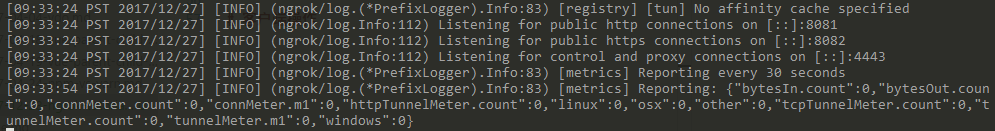
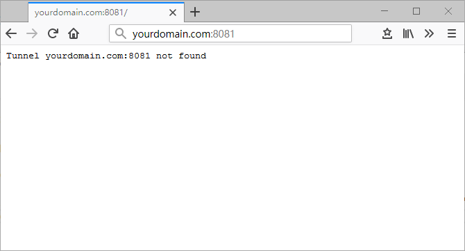

# The Problem

Lately I've been developing some APIs on my home computer. Locally, I can reach them at `http://localhost:8000`. But once I leave home, there is no way to reach them directly over the internet.  
If I committed and deployed to my VPS every time before going out, there would be two problems:
1. It's a real hassle.
2. Sometimes the code is still being developed and debugged, and isn't ready to be deployed to the VPS.  

The best solution is to use a public domain and port as a relay that leads straight to a port on the dev machine at home. That is, I can visit `http://xxx.ralfz.com:8081` to get the content of `http://localhost:8000`.  
Below, we'll use ngrok to solve this problem.

# What You Need

1. A VPS on the public internet
2. A domain name pointing to that VPS
3. A dev machine, like my home computer

# On the Server

My VPS runs CentOS. Here are the steps.  

Install the tools:  
```bash
sudo yum install build-essential golang mercurial git
```
Make sure they all install successfully.  
(For me, `build-essential` failed to install. Following [this answer on StackExchange](https://unix.stackexchange.com/questions/16422/cant-install-build-essential-on-centos), I solved it with `sudo yum groupinstall 'Development Tools'`.)  

Download ngrok:  
```bash
git clone https://github.com/inconshreveable/ngrok.git ngrok
cd ngrok
```

Generate the certificates (replace the domain with your own VPS's domain):  
```bash
NGROK_DOMAIN="yourdomain.com"
openssl genrsa -out base.key 2048
openssl req -new -x509 -nodes -key base.key -days 10000 -subj "/CN=$NGROK_DOMAIN" -out base.pem
openssl genrsa -out server.key 2048
openssl req -new -key server.key -subj "/CN=$NGROK_DOMAIN" -out server.csr
openssl x509 -req -in server.csr -CA base.pem -CAkey base.key -CAcreateserial -days 10000 -out server.crt

cp base.pem assets/client/tls/ngrokroot.crt
```

Build ngrokd, the server:  
`sudo make release-server`  

Start it:  
`sudo ./bin/ngrokd -tlsKey=server.key -tlsCrt=server.crt -domain="yourdomain.com" -httpAddr=":8081" -httpsAddr=":8082"`  

Once it's running, you'll see:  
  

Visiting `yourdomain.com:8081` shows `Tunnel yourdomain.com:8081 not found`, which means the server has started successfully.  
  

Next, we need to build the ngrok client for the client's platform. My client (the dev machine) runs 64-bit Windows, so I run this on the VPS:  
```bash
GOOS=windows GOARCH=amd64 make release-client
```

The settings for each platform:  

    Linux, 32-bit: GOOS=linux GOARCH=386
    Linux, 64-bit: GOOS=linux GOARCH=amd64
    Windows, 32-bit: GOOS=windows GOARCH=386
    Windows, 64-bit: GOOS=windows GOARCH=amd64
    Mac, 32-bit: GOOS=darwin GOARCH=386
    Mac, 64-bit: GOOS=darwin GOARCH=amd64
    ARM: GOOS=linux GOARCH=arm

Build the ngrok client for your own client platform.  
After a successful build, the client files are generated under `./bin`, in a folder named after the client platform (mine is `./bin/windows_amd64`).

Finally, copy the client folder to the client computer with scp or similar, for the next step.  

(Note: keep the server running.)

# On the Client

Open the client folder you copied over, and you'll see the `ngrok` executable. In that folder, add a new file `ngrok.cfg` with the following content:
```
server_addr: yourdomain:4443
trust_host_root_certs: false
```
Finally, start it with the following command:  
```bash
ngrok.exe  -subdomain=pub -proto=http -config=ngrok.cfg 8000
```
Here, 8000 is the local port on the client that you want to reach from the internet, and pub is the subdomain.

Now open `pub.yourdomain.com:8081`, and you'll see your local service.

# Wrapping Up  

Those are the basic steps for exposing a local machine with ngrok. The tool can do a lot more, which I'll explore over time.
