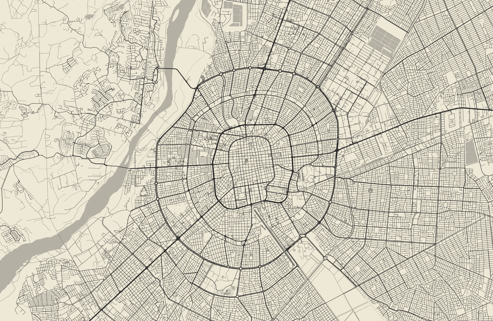
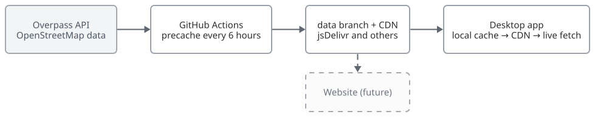
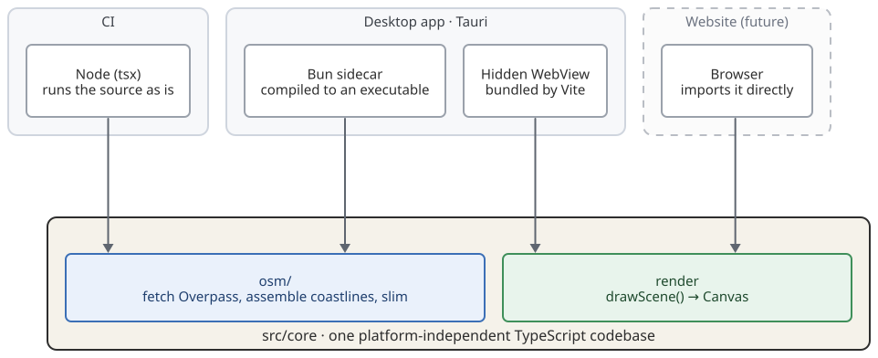
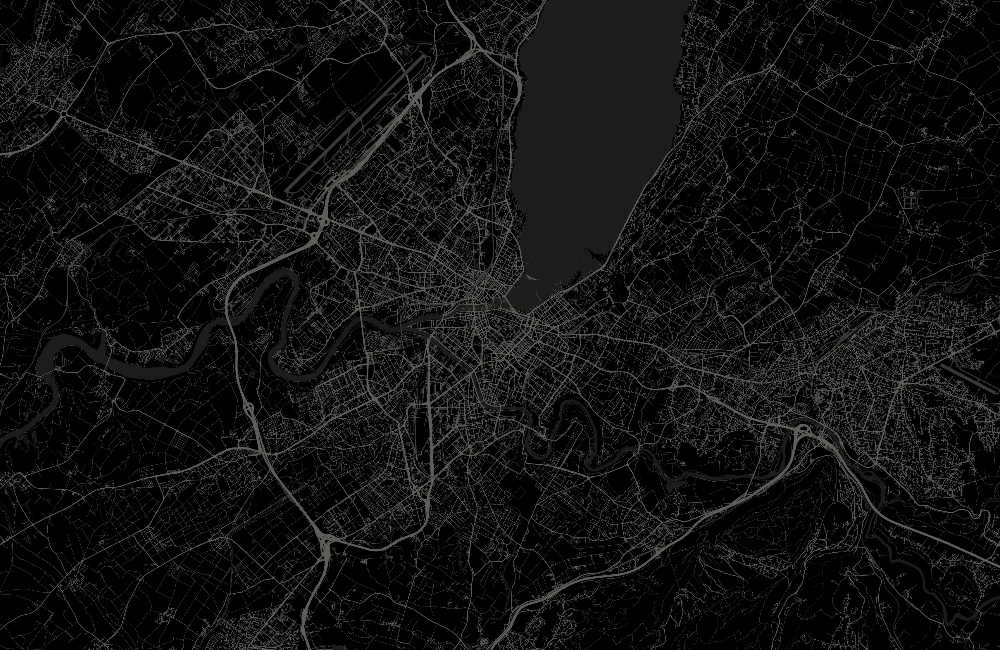

Just after midnight on October 6, InkCity left these three lines in the log on my computer (the times are UTC, which works out to just past midnight local time):

```text
[07:00:09] [pipeline] scheduled city for 2026-10-06: Santa Cruz de la Sierra (BO)
[07:00:09] [renderer] drew 355 water, 31410 roads, 6 railways, 62 airports at 3420x2224
[07:00:11] [pipeline] wallpaper set: Santa Cruz de la Sierra (BO)
```

Within two seconds it had fetched the day's city, Santa Cruz de la Sierra in Bolivia, drawn its 30,000-plus roads, water and airport runways into a screen-sized image, and set it as the wallpaper:



*The wallpaper for October 6. Santa Cruz's old town sits at the center of concentric ring roads; on the left is the Piraí River. Map data © OpenStreetMap contributors.*

InkCity is a desktop app I started at the end of May. Every day at midnight it picks one of more than a thousand cities, draws its OpenStreetMap road network as an "ink on paper" map, and sets it as the wallpaper. It runs on macOS, Windows and Linux, and the code is on [GitHub](https://github.com/RalfZhang/ink-city).


From the first commit on May 28 to v0.12.2 on September 7, I shipped 30 versions. The feature fits in one sentence, but drawing a random city well, automatically, every day, on three platforms and on every kind of network turned out to be much harder than I expected. Below I follow the order in which a wallpaper comes to life (picking the city, fetching the data, drawing, landing on the desktop, shipping releases) and record the trickiest problems along the way. At the end I share what it was like building this with Claude Code as a pair programmer.

**TL;DR:**

- Small project, needed to ship fast, needed three platforms: Tauri is smaller than Electron, easier to pick up than Qt, and lets me reuse my front-end experience.
- The renderer is platform-independent TypeScript, shared by the desktop app, local scripts and a future website.
- Don't build a once-a-day desktop job on one long sleep: the monotonic clock barely moves while the machine sleeps. Reconcile once a minute instead.
- Only ever add to a data format: new layers go into new fields with a version bump, so any mix of old and new clients and old and new data works.
- Don't invent map-rendering rules; check what openstreetmap-carto does first.
- Create the release as a draft and publish it only after every asset is uploaded, so update checks never 404; with signed update bundles, you can safely download through untrusted mirrors.
- On Linux, neither the system tray nor a "primary monitor" can be taken for granted.

## Day One

It started with a `task.md`, and the stack was settled before I wrote any code: Tauri 2 (Rust + React/TypeScript); maps drawn on a Canvas inside a hidden WebView and exported as PNG; data from OpenStreetMap's Overpass API; the visual style inspired by [city-roads](https://github.com/anvaka/city-roads).

### Why Tauri

This is a tiny project and I wanted to ship it quickly. I cared about four things when picking a framework: one codebase for three platforms, because building each platform separately costs too much time and has a steep learning curve; a small installer with just enough features; being able to use the React + TypeScript I already know; and, ideally, learning something new along the way.

| | Native per platform | Electron | Qt | Tauri |
|---|---|---|---|---|
| One codebase for three platforms | ✗, three codebases | ✓ | ✓ | ✓ |
| Installer size | Smallest | Large: bundles Chromium and Node.js | Medium: ships the Qt runtime | Small: uses the system WebView |
| Tray, launch at login, auto-update | Written once per platform | Off-the-shelf solutions | Partly; you assemble the rest | Official plugins |
| UI in React + TypeScript | ✗ | ✓ | ✗, C++ / QML | ✓ |
| New things to learn | Swift, C# and GTK: three sets of APIs | Almost nothing | C++ / QML, steep curve | A bit of Rust, backend only |
| From zero to shipped | Slow | Fast | Slow | Fast |

In hindsight, it was the right call:

- One codebase produced both the macOS and Windows builds. When I added Linux in September, the new platform code was mostly two files: setting the wallpaper (389 lines) and detecting the tray (117 lines).
- Both the settings UI and the map renderer are TypeScript, so my front-end experience carried straight over.
- The installers are 33 MB on Windows and 68 MB on macOS (universal). Not tiny, but most of that is the Bun sidecar I'll get to later: it takes up 132 MB of the macOS app bundle, while the Tauri app itself is just 43 MB for both architectures combined.

There are costs too. The three platforms use different WebView engines (WKWebView, WebView2, WebKitGTK), and each needs its own testing. Tauri's bundler has bugs of its own, too; see "Five versions in one day" below.

### An MVP in one day

The MVP was a single loop: pick today's city → fetch the OSM data → render a PNG → set the wallpaper. The cities were GeoNames' 1,000 most populous, and the date determined the index:

```text
index = (days_since_2023-03-03 × 379) % N
```

379 is prime and coprime to N, so the mapping is a permutation: it looks random, yet never repeats within a cycle.

The first commit landed in the early hours of May 28, and v0.2.0 shipped that same evening.

## The Architecture Today

Three months later the loop is the same, but every step has been reimplemented:



Rendering and data processing live in `src/core/`, platform-independent TypeScript shared by the desktop app, CI and a future website:



Compared with the first version:

| | May (v0.2) | September (v0.12) |
|---|---|---|
| Which city today | Computed by the client from a formula | Drawn at random by CI (with cooldowns) and stored as a schedule |
| Map data | Precached on jsDelivr; on failure, Rust queries Overpass directly | A multi-CDN ladder; on failure, a sidecar built from the same code as CI fetches it live |
| Layers | Roads | Roads, water, airports, railways, aerial lifts |
| Platforms | macOS, Windows | Plus Linux |
| Releases | Tagged by hand | Automated by release-please, published as drafts first |

## Picking the City

### From "most populous" to "most famous"

A week in, the population list showed its problem: it was full of cities with huge populations that most people had never heard of. The fun of the wallpaper is wondering "where is this today?" If most days bring a city people don't know or care about, the product stops being fun.

So I put together two new pools:

- `cities-famous.json` (992 cities): ranked by "fame", the number of Wikidata sitelinks (how many language editions of Wikipedia have an article on the city) times the log of its population;
- `cities-countries.json` (284 cities): the capital and the largest city of every inhabited country and territory (ISO 3166-1). For tiny countries like Nauru, where the two points sit next to each other, only one is kept.

Merged and deduplicated by id, the two pools give about 1,055 cities, which is where the daily city comes from today. Here's how the choices compare:

| | Population top 1000 | Fame top 992 | Capitals + largest cities | Current pool |
|---|---|---|---|---|
| Cities | 1000 | 992 | 284 | 1055 |
| Countries and territories covered | 132 | 197 | 243 | 243 |
| Most represented country | China 26.5% | US 11.8% | 1–2 per country | US 11.1% |
| China + India share | 35.7% | 8.7% | 1.4% | 8.2% |
| Within 20 km of a larger city | 148 | 48 | 9 | 55 |

The population list had two problems. It clusters: China and India make up more than a third of it. And it repeats itself: districts and satellite cities get their own entries, such as Pudong and Minhang in Shanghai, or Brooklyn and Queens in New York. With a wallpaper only 20 km wide, they come out as nearly the same picture. The fame list solves the "never heard of it" problem but leans toward Europe and North America, with the US alone at 11.8%. Adding every country's capital and largest city raises coverage from 197 countries and territories to 243.

In the settings window, a second line under the city name shows its local name, and the rules for it kept growing: Lhasa is written in Tibetan as ལྷ་ས་, Hohhot in vertical Mongolian script as ᠬᠥᠬᠡᠬᠣᠲᠠ, Québec's Montréal stays in French, and each Indian state uses its own official language. In short, it's whatever language the locals use, with English as the fallback.

### Coordinates: where is a city's "center"?

A city's coordinate sets the download area, the crop center and the projection origin all at once. The long edge of the picture is only 20 km, so a few kilometers off and the city slides into a corner.

GeoNames and Wikidata coordinates are often the geometric center of an administrative area. Comparing the two sources, Dubai was 21 km off; the center of Tokyo Metropolis even lands about 980 km out in the Pacific, because the metropolis governs the Ogasawara Islands far to the south.

I switched to OSM's `place` nodes: the point mappers put at the city center, which openstreetmap.org also uses to label the city. Even so, the center ultimately has to be judged by looking at the render. Hangzhou's node sits in Qianjiang New City, which leaves only a sliver of West Lake in the frame, so I kept the old coordinate centered on the lake.

### From a formula to a schedule

`(days × 379) % N` has the advantage of being stateless: any machine can work out which city a given day gets. The downside is that you can't pin a city to a day, and changing the pool changes every day.

Now the schedule is stored instead. Each GitHub Actions run draws a city for "today + 6" only and writes it to the schedule, `city-list.json`, on the `data` branch; a day that already has a city is never re-rolled. The draw has two cooldowns: no repeat of a city within 30 days, or of a country within 5. To pin a city to a day, I just edit the JSON. The client no longer computes anything; it only reads the schedule, and on a day it can't get the schedule, it leaves the wallpaper as it is.

I also considered a pseudo-random generator seeded with the date, but it has the same problems as the formula. The three approaches side by side:

| | Formula `(days × 379) % N` | PRNG seeded by date | Stored schedule (today) |
|---|---|---|---|
| State | None; any machine can compute it | None; any machine can compute it | A JSON file to maintain |
| Pin a city to a specific day | ✗ | ✗, only by fiddling with the seed | ✓, edit the JSON |
| After changing the pool, past days | All change | All change | Stay the same |
| No city repeat within 30 days, no country within 5 | City ✓, country ✗ | ✗ | ✓ |
| Client can compute it when the schedule is unreachable | ✓ | ✓ | ✗, the wallpaper stays unchanged that day |

The schedule's main cost is the last row. But even with a formula as a fallback, what you'd draw is a city that doesn't match the schedule, so it's better not to change at all.

## Fetching the Data: From Overpass to a CDN

OSM data comes from the Overpass API: a single union query returns the roads, water, airports, railways and aerial lifts within a 20 km square. But Overpass is a free public service. It's slow, it rate-limits (429 / 504), it rejects requests without a User-Agent with a 406, and it's often unreachable from mainland China. Having every user's computer query it at midnight would be both unreliable and a burden on a public service.

### GitHub as a CDN

So precaching was there from day one: every 6 hours, GitHub Actions fetches the next few days' data, slims it down, and pushes it to the repo's `data` branch, which jsDelivr serves as a CDN. Only the latest data matters, so each run rebuilds `data` as a single orphan commit and force-pushes it.

jsDelivr caps single files at 20 MB, and one day of Toronto is 28.8 MB, so every file also ships as a `.gz`. That's not to save bandwidth, but so the CDN will serve the file at all. There's more than one CDN, too: after jsDelivr's several hostnames come statically and githack, and GitHub raw, which is often DNS-poisoned in mainland China, comes last.

### A data format you only add to

Old and new versions coexist for a long time: users don't always upgrade, but there's only one copy of the data on the CDN. The rule: `elements` only ever holds roads, in exactly the shape of the first version; every new layer goes into a new top-level field, and `v` marks the version.

```json
{
  "v": 6,
  "elements":   [{ "type": "way", "tags": { "highway": "primary" }, "geometry": [...] }],
  "water":      [...],
  "airports":   [...],
  "railways":   [...],
  "aerialways": [...],
  "date": "2026-10-06",
  "city": { "name": "Santa Cruz de la Sierra", "country": "BO", "lat": -17.78, "lon": -63.18 }
}
```

Old clients ignore fields they don't know, and new clients treat a missing layer as switched off. Had I put water into `elements`, old clients would have drawn every lakeshore as a road.

One more rule: adding a layer bumps the version. CI skips cities it has already cached and refetches only when the version changes. Add a field without a bump, and the cached cities never get the new layer, so it takes days to show up.

### One codebase, two ways in

Data arrives by two routes: the CI precache, and a live fetch by the client when every CDN fails. At first these were two separate codebases: TypeScript in CI, and a small Rust client on the desktop with a "keep in sync" comment. Once water shipped, they were no longer in sync. Turning coastlines into seas needs the JS library `polygon-clipping`, which the Rust version didn't have, so whenever the CDN missed, the fallback data lacked an entire water layer.

The fix was to delete the Rust version and compile the TypeScript fetcher into an executable with `bun build --compile`, shipped in the installer as a Tauri sidecar that Rust launches as a subprocess when needed. Since then, the fallback data has matched the CDN exactly. The cost: the installer now carries a 60-plus MB binary with its own runtime, and it's also why there's no Linux AppImage (more on that later).

### A `.git` that kept growing

The `data` branch had another side effect: my local `.git` kept growing, and `git gc` couldn't shrink it.

Each orphan commit shares no history with the previous one, so every fetch adds a whole new data tree of about 130 MB. Deleting the branch doesn't help: the reflog of `refs/remotes/origin/data` records one entry per fetch, each pinning the whole tree from that moment, and `git gc` treats reflog entries as reachable until they expire after 30 days. At one point 42 fetches had piled up about 190 MB, and `git gc --prune=now` couldn't free a single byte of it.

The fix is a negative refspec so that `git fetch` skips the branch, plus immediate reflog expiry for it (both set up automatically by `pnpm install`):

```bash
git config --add remote.origin.fetch '^refs/heads/data'
git config gc.'refs/remotes/origin/data'.reflogExpire now
```

## Drawing: Turning OSM Data into a Wallpaper

The canvas matches the screen's physical pixels, the crop matches the screen's aspect ratio, and coordinates map linearly onto the canvas, so nothing is ever stretched. The hard part is what to draw, and how to make it look good.

### Where to render

There were three places the rendering could live:

| | Client: Canvas in a hidden WebView (today) | Client: native Rust drawing | CI prerenders PNGs, client only downloads |
|---|---|---|---|
| Draws at each screen's resolution and aspect ratio | ✓ | ✓ | ✗, too many screen sizes; can only scale and crop |
| Switches theme, colors and line weight offline | ✓ | ✓ | ✗, every combination needs its own render |
| Daily download | Map JSON, a few MB gzipped | Same | One PNG per combination; a single 3420×2224 one is 2–5 MB |
| Extra dependencies | None; the WebView is already there | A drawing library | None |
| Code shareable with the website | ✓, the same TypeScript | ✗ | ✓ |

CI prerendering was out first: aspect ratios, light and dark themes, custom colors, three line weights and the experimental toggles multiply into more combinations than you could ever enumerate. Of the remaining two, native Rust might be faster, but it means writing a second renderer that the website couldn't use. Canvas in the WebView is fast enough (the 30,000-road map from the opening took two seconds from data to wallpaper), and the code is reusable.

Reuse requires a renderer that knows nothing about the platform. `src/core/` depends only on the standard Canvas 2D API, not on Tauri, React or Node, and its entry point is a single function:

```ts
export function drawScene(ctx: CanvasRenderingContext2D, req: DrawReq): SceneCounts
```

The desktop app calls it inside the hidden WebView, and my local batch-render script calls it through node-canvas. A future website can use the folder as is: read the same day's data from the same CDN, and draw exactly the same picture in the browser. The heavy lifting, such as fetching data and assembling coastlines, lives in `src/core/osm/`. It runs only in CI and the sidecar, and never ships in the client or the website.

### Water: second time lucky

My first attempt was in late May: draw the boundaries between land and water, meaning coastlines, riverbanks and lakeshores. The lines tangled with the roads, a single river could sprout several lines, and in the end I set it aside.

Two weeks later I tried again, differently: I wrote down the requirements before touching any code. An excerpt, translated from Chinese:

> 1. Fill whole bodies of water only; no outlines.
> 2. To avoid all sorts of bugs, I think we should copy openstreetmap's water coloring as closely as we can. Note: base colors only, no special textures (marshes and the like).
> 3. If the JSON data needs to change, keep it compatible with users on the current version…
> 4. If you need temporary test data, save it under …/water_color_test/ … and put light and dark renders sized for my screen in the same folder, with a timestamp suffix … so I can compare before and after.
> 5. Include test data for Macau, Xi'an, San Jose, Sydney, Kanayannur and Glasgow…

The first round made the problems obvious: the island where Macau's Taipa sits was painted as sea, and San Jose's Coyote Creek wasn't painted as a river. Along with those two bugs, I added Amsterdam, Qujing, Ipoh, Panama City and Nauru's Yaren as test cities.

The Taipa bug is a good illustration of how OSM represents the sea:

- OSM has no "sea" polygon, only coastlines (`natural=coastline`), with a convention: **land on the left, water on the right**;
- to draw the sea, you chain the coastlines that cross the frame, clip them to it, then walk the frame's edge clockwise, closing off the regions with water on the right;
- islands are closed rings, cut out of the sea at the end.

Part of Taipa stuck out past the frame, so it was mistaken for mainland coastline crossing the frame, and the island's land ended up enclosed in the sea. The fix: first treat every coastline that closes into a ring as an island, whether or not it pokes outside the frame (stitching without regard to direction, which also tolerates rings drawn the wrong way round). Only the open chains left over count as mainland coast. Finally, `polygon-clipping` unions all the sea and subtracts all the islands. One more edge case: if no coastline crosses the frame at all, is it all land or all sea? If there isn't a single road either, it's sea.



*Geneva on October 1 (dark theme). Lake Geneva is at the top, with the Rhône flowing west out of it; the parallel diagonal lines at top left are the airport's runway. Map data © OpenStreetMap contributors.*

### Airport runways: ask upstream first

One day in early August the city was Ceuta, and its runway came out as a fat hollow ring. Plotting every cached city's runways side by side made it clear: OSM maps a runway either as a centerline or as a closed polygon outlining the whole runway. Ceuta's was the latter, and stroking it as a centerline produced the ring.

So when does a closed way count as an area? The AI proposed two rules in turn, one of them "only if it's tagged `area=yes`". Instead of taking either, I asked: "Could you look into how osm-carto implements this, and match it as closely as possible?"

Checking upstream showed both rules were wrong. openstreetmap-carto (openstreetmap.org's default style) settles this when the data is imported: osm2pgsql treats `aeroway` as a polygon tag, so **any closed aeroway is an area** unless it's tagged `area=no`. As for `area=yes`, only 9 of the 23 cities I sampled carried it.

Since then, "check osm-carto first, and cite it in a comment" has been the rule for rendering decisions; the railway styles, and what to leave out of them, were settled the same way later.

### Line width and aspect ratio

In September, while tuning line widths, I had the AI build a local test bench that re-renders 18 cities from real data in one go. When I asked for 5000×5000 squares, it warned me that roads would come out 54% thicker than on the real wallpaper.

The reason: line width scaled with the canvas's pixel height (`height / 1000`), while the frame is always 20 km wide and its height in kilometers depends on the aspect ratio. Cancel out the height, and **a road's width on the ground = weight × the frame's height in km**. So resolution doesn't change the look, but aspect ratio does:

| Aspect ratio | Frame height | Motorway width on the ground |
|---|---|---|
| 16:10 (2560×1664) | 13.0 km | 32.5 m |
| 16:9 (3840×2160) | 11.25 km | 28.1 m |
| 21:9 (3440×1440) | 8.37 km | 20.9 m |
| 32:9 (5120×1440) | 5.63 km | 14.1 m |

On an ultrawide monitor, roads were only two-thirds as wide as on a laptop, and the whole map looked thin and faint.

My first instinct was to multiply by 1.2. The AI pointed out that this would just make everything thicker, with the dependence on aspect ratio still there. The right fix is to anchor line width to distance on the ground:

```ts
const METERS_PER_WEIGHT = 12;

function strokeScale(bbox: Bbox, height: number): number {
  const pxPerKm = height / groundHeightKm(bbox);
  return (METERS_PER_WEIGHT / 1000) * pxPerKm;
}
```

Picking 12 had a nice side effect: the weight table now reads as real road widths, with a motorway at 2.5 × 12 = 30 m, a residential street at 8.4 m and a footway at 3.6 m. After the change, motorways measured about 30 m at every aspect ratio.

## On the Desktop: Midnight, Sleep and Linux

### Changing the wallpaper at midnight: don't trust sleep

The first scheduler was straightforward: work out how many seconds remain until the next midnight, sleep that long, then wake up and change the wallpaper.

```rust
let wait = secs_until_next_midnight();
tokio::time::sleep(Duration::from_secs(wait)).await;
```

In testing, I found the wallpaper on my own computer wasn't updating by itself, so I listed the scenarios that had to work and had the AI check each one:

1. The computer stays on past midnight;
2. It's shut down before midnight and turned on the next day;
3. It goes to sleep before midnight and wakes the next day;
4. The screen is locked across midnight and unlocked afterwards;
5. A user who follows the system's light or dark mode sees the system switch themes during the day.

Scenario 3 was the problem. `tokio::time::sleep` runs on a monotonic clock, which barely advances while the machine sleeps: close the lid for the whole night, and the scheduler may think only a few minutes have passed, still waiting for that midnight.

The fix was to give up on "sleep until a given moment" entirely and **reconcile every 60 seconds** instead:

```rust
async fn reconcile(app: &AppHandle) {
    let Some(desired) = pipeline::desired_signature(app) else {
        return; // updates disabled, or Customized with no pin
    };
    let up_to_date =
        app.state::<AppState>().last_applied.lock().unwrap().as_deref() == Some(desired.as_str());
    if up_to_date {
        return;
    }
    if let Err(e) = pipeline::run_now(app.clone()).await {
        log::error!("[scheduler] pipeline failed: {}", e);
    }
}
```

The desired state is a string, `daily:<local date>:<light|dark>`. Compare it with what's actually set, and redraw if they differ. In steady state this costs almost nothing, and crossing midnight, waking, unlocking, booting, changing time zones or switching themes are all caught within a minute. That's how the wallpaper in the opening log was in place seconds after midnight.

### Linux: nothing is a given

Linux support (deb and rpm) arrived in early September. What macOS and Windows treat as platform guarantees is mostly optional on Linux:

- **There's no single API for setting the wallpaper.** InkCity dispatches on `XDG_CURRENT_DESKTOP`: `gsettings` on GNOME, D-Bus calls into the scripting interface on KDE Plasma, `xfconf-query` on XFCE, and best effort everywhere else. The existing `wallpaper` crate wouldn't do. It only writes `picture-uri`, while GNOME in dark mode reads `picture-uri-dark`, so the wallpaper stays on yesterday's image forever; it relies on `qdbus`, which Plasma 6 renamed; and it starts a new `swaybg` process on every call without ever reaping the old one, which leaks one process a day.
- **The tray may not exist.** InkCity has no Dock or taskbar icon; the tray is its only entry point. GNOME 45 and later ship without a tray, yet registering a tray icon still "succeeds", so after launching at login the process runs and the user has no way to reach it. InkCity now probes D-Bus for a tray host at startup and opens the settings window if there isn't one.
- **Wayland has no "primary monitor".** `primary_monitor()` always comes back empty, so InkCity falls back to the monitor holding the current window, then to the first monitor.
- **There are no in-app updates.** deb and rpm packages belong to the package manager, so InkCity doesn't overwrite them. An AppImage, which could update itself, can't be built: linuxdeploy rewrites the rpath of every ELF in `usr/bin`, after which `ldd` fails on the Bun-compiled sidecar; patching it back with patchelf shifts the offsets Bun uses to find its embedded code, and the binary segfaults.

## Shipping Releases: Drafts, Tags and Signatures

### Draft releases: keep update checks from 404ing

Tauri's updater requests `releases/latest/download/latest.json`, downloads the new version, verifies its minisign signature and installs it. The catch: as soon as a release is published, `releases/latest` points at it, while the installers for three platforms and `latest.json` are still being built and uploaded, so every update check in that window gets a 404. v0.3.0 shipped exactly like that, and the window lasted 7 to 10 minutes.

So every release now starts as a draft. Only after all three platforms have built, signed and uploaded does a final job publish the draft and mark it as latest. If any platform fails, the draft just sits there, and users stay on the last complete version.

### release-please: drafts have no tag

Later I handed releases over to release-please. Commits follow Conventional Commits, it opens a release PR automatically, merging that PR creates the release and the tag, and the tag triggers the build.

Combined with draft releases, something odd happened: every time I merged a release PR, it immediately opened another one that re-collected **the entire repository history**, all the way back to `feat: v1`.

The cause: GitHub doesn't create a tag for a draft release until it's published. release-please relies on that tag both to trigger the build and to know which commits came after the last release. It also computes the next PR **in the same run**, right after creating the release, so the anchor was gone.

My first fix added a step after it that created the tag by hand. The logs showed the bogus PR pushed at 09:36:10 and the tag created at 09:36:12: two seconds too late. An external step simply can't get in between the steps of a single release-please run. The real fix was one line of config, `"force-tag-creation": true`, which makes release-please tag the draft immediately. Four bogus PRs appeared before that, and none since.

### Five versions in one day

On August 8 I shipped a new icon, and went from v0.10.0 to v0.10.4 that same day.

On macOS 26, the icon has to be made as a layered `.icon` in Icon Composer and compiled into `Assets.car` by Xcode 26's `actool`; otherwise the old icon gets boxed into a gray rounded square. The trouble is that when this step fails, Tauri's bundler logs a single line and carries on. Signing and publishing all succeed, and only the icon is wrong.

- **v0.10.0**: `squares` in `icon.json` was written as a list, but it only accepts the string `"shared"`.
- **v0.10.1**: `actool` crashed when run by the bundler, yet the identical command ran fine in a terminal. Only `--verbose` revealed the real exception, buried in the debug log: an unfixed Tauri bug ([#15315](https://github.com/tauri-apps/tauri/issues/15315)).
- **v0.10.2**: I precompiled `Assets.car` myself to bypass the bundler. The build passed, but the icon was a flat taupe square: `actool` had reversed the layer order and put the background on top, without a single error. This version was "Latest" for 55 minutes.
- **v0.10.3**: The layer order was fixed, but the build failed on a check that hadn't changed: `assetutil | grep -q` exits on the first match, `assetutil` gets SIGPIPE, and `pipefail` marks the whole pipeline as failed. It's timing-dependent, so the previous version happened to pass.
- **v0.10.4**: Storing the output in a variable before matching fixed it. Green at last.

The lesson: **silent failures need explicit assertions.** The build now checks that `Assets.car` exists, that `CFBundleIconName` is set, and that the layers are in the right order. Draft releases stop failed builds from going out, but not builds that succeed with the wrong result, which is exactly how v0.10.2 slipped through.

### Making updates work in mainland China

Updates often failed for users in mainland China. It turned out the map data had long had a multi-CDN fallback, but the update path depended on github.com alone. The update check had no timeout, and the nearly 70 MB installer couldn't resume a download. On these connections the problem is usually not a dead link but a slow one: a few dozen KB/s, or a reset halfway through, and every failure started over from zero.

Even sneakier was a preflight check. Before each background check, the app did a TCP handshake with `github.com:443` and skipped the check if it failed, to avoid the "just woke up, Wi-Fi not back yet" case. But on a network where github.com is unreachable, that handshake always fails: **automatic updates were silently switched off for an entire region**.

The fix rests on signatures. The bundle must verify against the public key compiled into the app, and the updater only accepts higher versions, so a download source can at worst make the download fail; it can't slip in a forged build or roll users back. That makes it safe to use GitHub proxies run by individuals. (The map data isn't signed, so that side sticks to CDNs run by big companies.)

I first had the AI test 17 public proxies. Only 5 worked, but all 5 supported HTTP Range requests, which made resuming possible. The final download strategy:

- the origin, github.com, always goes first, then each proxy in turn;
- the first pass is "impatient": below 50 KB/s after 20 seconds, move on to the next host; the second pass has no speed limit;
- switching hosts resumes with `Range`, so no downloaded byte is wasted;
- the proxy list lives in its own file, compiled in as the default and refreshed from the main branch at runtime, because **a broken update path can't deliver its own fix**;
- the preflight now probes the origin and all the proxies in parallel, and goes ahead if any one of them answers.

## Pair Programming with AI

This project was written with Claude Code as a pair programmer from the very first line. I set requirements, made decisions, accepted the work and wrote the commits; it read code, looked things up, and wrote code and tests. A few takeaways:

- **Write requirements like tickets.** The second time around with water, I spelled out which approach to follow, what not to do, the compatibility requirements, where test data goes and which cities to test. That was far more effective than the first attempt's single line, "let's add the boundaries between water and land to the map". One night before bed, I handed it the GitHub issues, with the branch and commit formats agreed, the issues ordered from clearest to vaguest, and anything uncertain to be left as a doc for discussion. When I woke up, six issues were done and committed.
- **Verify before building.** With the update mirrors, I had it test the proxies first; finding that Range worked is what settled the design.
- **Make it check upstream instead of relying on memory.** After the runway episode, "read the osm-carto source first" went into its long-term memory.
- **Make it explain with concrete numbers.** The line-width bug surfaced when I asked it to explain a formula "using my computer and a 4K screen as examples".
- **Do the acceptance testing yourself.** While testing water, I set the system clock to 23:58. Two minutes later, the new day's wallpaper was nothing but background color, without a single road.
- **Turn preferences into rules.** The project's memory has collected a dozen or so: consider Windows in every change, transient UI must not shift the layout, and commits are mine to write.

AI is great at breadth: reading a dependency's source to confirm its semantics, testing 17 proxies in minutes, remembering that `picture-uri-dark` only arrived in GNOME 42. But deciding which cities are interesting, judging whether a wallpaper looks good, and the final acceptance check are still on me.

## Wrapping Up

The schedule for October 8 has Ngerulmud, the capital of Palau: a capital made up of government buildings, with no residents at all. That day's data is just 0.2 MB, so it will probably be a very empty wallpaper.

What I might do next: split the macOS update bundle by architecture; move the sidecar out of `usr/bin`, so a self-updating AppImage becomes possible; build a website, and a daily guess-the-city game.

For a small app you can describe in one sentence, the real work hides in a few words: every day, automatically, on three platforms.

If you'd like your desktop to show a new city every day, you can download InkCity from [GitHub Releases](https://github.com/RalfZhang/ink-city/releases/latest); questions and ideas are welcome as [issues](https://github.com/RalfZhang/ink-city/issues). Thanks to Jie Xu for the icon and the map's visual design. Map data © OpenStreetMap contributors (ODbL); city list from GeoNames (CC BY 4.0).
