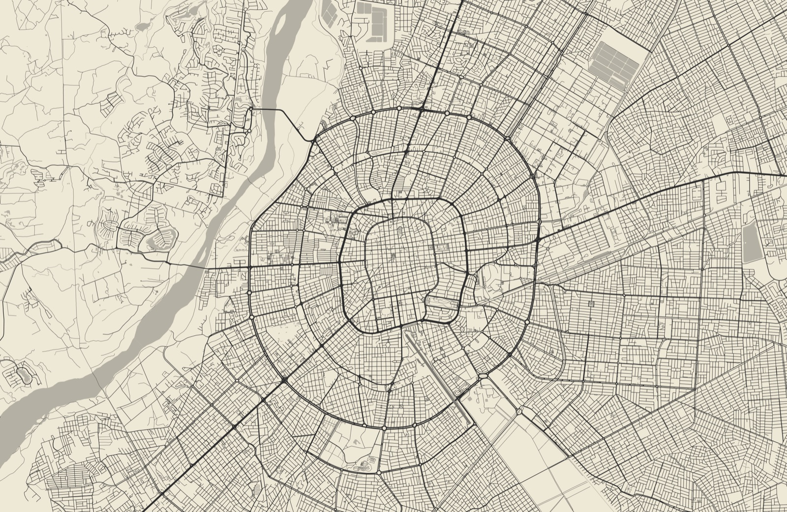
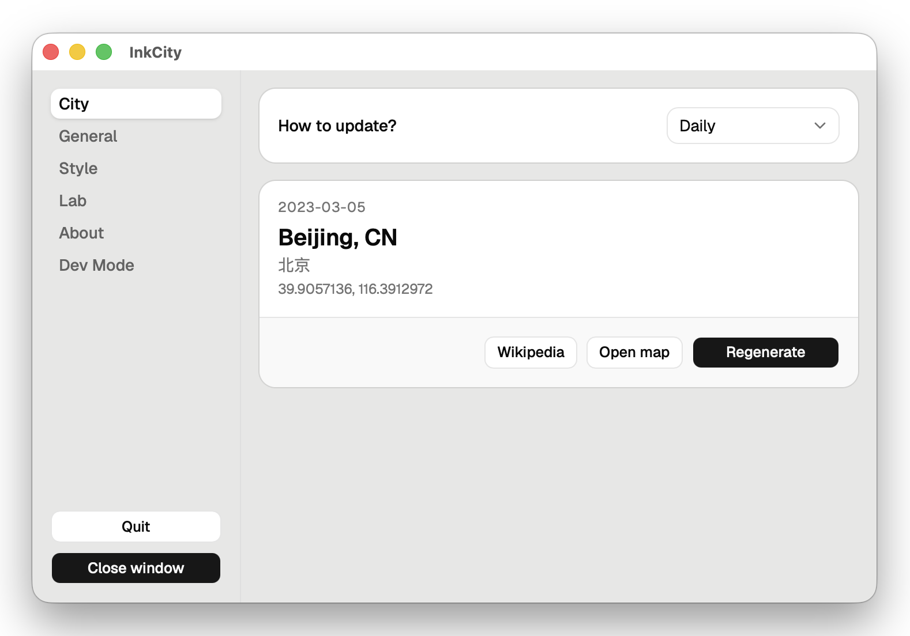
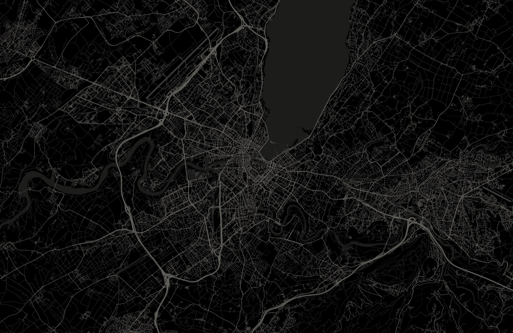

10 月 6 日零点刚过，我电脑上的 InkCity 留下了三行日志（时间是 UTC，换算过来正是本地零点刚过）：

```text
[07:00:09] [pipeline] scheduled city for 2026-10-06: Santa Cruz de la Sierra (BO)
[07:00:09] [renderer] drew 355 water, 31410 roads, 6 railways, 62 airports at 3420x2224
[07:00:11] [pipeline] wallpaper set: Santa Cruz de la Sierra (BO)
```

两秒内，它拿到当天的城市——玻利维亚的圣克鲁斯，把 3 万多条道路、水体和机场跑道画成一张屏幕大小的图，设成了壁纸：



*10 月 6 日的壁纸。圣克鲁斯的老城被一圈圈环路包着，左边是皮拉伊河。地图数据 © OpenStreetMap 贡献者。*

InkCity 是我 5 月底开始做的桌面应用：每天零点从一千多座城市里挑一座，把它的 OpenStreetMap 路网画成“纸上墨线”风格的地图，设为壁纸。支持 macOS、Windows 和 Linux，代码在 [GitHub](https://github.com/RalfZhang/ink-city) 上。



从 5 月 28 日的第一个 commit 到 9 月 7 日的 v0.12.2，一共发了 30 个版本。功能一句话就能说完，但要在三个平台、各种网络环境下，每天自动把一座随机城市画好看，比我想的难得多。下面按一张壁纸诞生的顺序——选城、取数据、画图、上桌面、发版本——记录其中最棘手的问题，最后聊聊和 Claude Code 结对开发的体会。

**太长不看版：**

- 小项目、要快、要跨平台：Tauri 比 Electron 小，比 Qt 好上手，前端经验也能直接用上。
- 渲染写成不依赖平台的 TypeScript，桌面端、本地脚本和将来的网站共用一份。
- 桌面上的“每天定时”别靠一次长 sleep：机器睡眠时单调时钟几乎不走。改成每分钟对一次账。
- 数据格式只加不改：新图层放进新字段并升版本号，新旧客户端和新旧数据才能任意组合。
- 画地图别自己发明规则，先看 openstreetmap-carto 怎么做。
- Release 先建草稿、资产传齐再公开，更新检查就不会 404；更新包有签名，就能放心走不可信的镜像。
- 在 Linux 上，托盘、主显示器都不是理所当然的。

## 第一天

起点是一份 `task.md`，技术栈动手前就定了：Tauri 2（Rust + React/TypeScript）；地图在隐藏的 WebView 里用 Canvas 画成 PNG；数据来自 OpenStreetMap 的 Overpass API；画风参考 [city-roads](https://github.com/anvaka/city-roads)。

### 为什么是 Tauri

这是一个很小的项目，我想尽快上线。挑框架时看重四点：一套代码跑三个平台，因为每个平台单独开发太费时间，学习成本也高；安装包要小，功能够用就行；能用上我熟悉的 React + TypeScript；最好还能顺便学点新东西。

| | 各平台原生 | Electron | Qt | Tauri |
|---|---|---|---|---|
| 一套代码跑三个平台 | ✗，三套代码 | ✓ | ✓ | ✓ |
| 安装包体积 | 最小 | 大，自带 Chromium 和 Node.js | 中，要带 Qt 运行库 | 小，用系统自带的 WebView |
| 托盘、开机自启、自动更新 | 每个平台各写一遍 | 有现成方案 | 部分有，要自己拼 | 官方插件 |
| 界面能用 React + TypeScript | ✗ | ✓ | ✗，C++ / QML | ✓ |
| 要学的新东西 | Swift、C#、GTK 三套 API | 几乎没有 | C++ / QML，曲线陡 | 一点 Rust，只用在后端 |
| 从零到上线 | 慢 | 快 | 慢 | 快 |

事后看，这个选择是对的：

- 一套代码同时出 macOS 和 Windows 两个版本；9 月加 Linux 支持时，新写的平台代码主要就两个文件：设壁纸（389 行）和托盘探测（117 行）；
- 设置界面和地图渲染都用 TypeScript 写，前端经验直接用得上；
- 安装包 Windows 33 MB，macOS（双架构）68 MB。不算小，但大头是后面要讲的 Bun sidecar：在 macOS 的应用包里它占了 132 MB，Tauri 应用本体（两个架构合计）只有 43 MB。

代价也有：三个平台的 WebView 内核不同（WKWebView、WebView2、WebKitGTK），要分别测；Tauri 的打包器也有 bug，后面“一天五个版本号”就是一例。

### 一天上线的 MVP

MVP 是一个闭环：选出今天的城市 → 拉 OSM 数据 → 渲染 PNG → 设壁纸。城市取 GeoNames 人口前 1000，按日期算下标：

```text
index = (days_since_2023-03-03 × 379) % N
```

379 是素数，和 N 互素，这个映射就是一个置换：看起来随机，一个周期内又不会重复。

5 月 28 日凌晨提交了第一个 commit，当晚就发了 v0.2.0。

## 现在的架构

三个多月后，闭环没变，每一环都换了实现：

```text
GitHub Actions (every 6 hours)
  ├─ schedule: pick a city for today+6, with cooldowns ─► osm-v2/city-list.json
  ├─ osm-cli (TypeScript): one Overpass query per day ─► osm-v2/data/<date>.json(.gz)
  └─ force-push to the `data` branch, served by jsDelivr & other CDNs

Desktop app (Tauri 2)
  ├─ Rust scheduler, every 60s: is the right wallpaper on screen?
  ├─ pipeline: resolve today's city + map data
  │    1. local day cache
  │    2. CDN manifest (each host: .gz, then .json; GitHub raw last)
  │    3. city-list.json + live Overpass fetch via the osm-cli sidecar
  ├─ hidden WebView: core/render.ts draws on a <canvas> ─► PNG
  └─ set wallpaper: macOS (JXA) / Windows (SPI) / Linux (per desktop)
```

渲染和数据处理都在 `src/core/`，是一份不依赖平台的 TypeScript，桌面端、CI 和将来的网站共用。和第一版相比：

| | 5 月（v0.2） | 9 月（v0.12） |
|---|---|---|
| 今天画哪座城 | 客户端按公式算 | CI 随机抽签（带冷却期），存成日程表 |
| 地图数据 | jsDelivr 预缓存，失败时 Rust 直连 Overpass | 多 CDN 阶梯，失败时用与 CI 同一份代码编译的 sidecar 现场抓 |
| 图层 | 道路 | 道路、水体、机场、铁路、索道 |
| 平台 | macOS、Windows | 加上 Linux |
| 发版 | 手动打 tag | release-please 自动发版，草稿发布 |

## 选城：每天画哪一座

### 从“人口最多”到“最有名”

人口榜用了一周就发现问题：列表里有大量人口很多、但大多数人没听说过的城市。壁纸的乐趣在于“今天是哪儿”，如果大部分日子出现的城市大家都不熟悉或者没兴趣，这个产品就不好玩了。

于是我准备了两个新的城市池：

- `cities-famous.json`（992 座）：用 Wikidata 的 sitelinks 数（有多少个语种的维基百科为它写了条目）乘以人口的对数，排出“知名度”；
- `cities-countries.json`（284 座）：每个有人居住的国家和地区（ISO 3166-1）取首都和最大城市。像瑙鲁这样的小国，两个点挨在一起，就只留一个。

两个池按 id 合并去重，约 1055 座城，这就是现在每日城市的来源。拿数据对比一下：

| | 人口前 1000 | 知名度前 992 | 首都 + 最大城市 | 现在的城市池 |
|---|---|---|---|---|
| 城市数 | 1000 | 992 | 284 | 1055 |
| 覆盖的国家和地区 | 132 | 197 | 243 | 243 |
| 占比最高的国家 | 中国 26.5% | 美国 11.8% | 每国 1–2 座 | 美国 11.1% |
| 中国 + 印度占比 | 35.7% | 8.7% | 1.4% | 8.2% |
| 离一座更大的城市不到 20 公里 | 148 座 | 48 座 | 9 座 | 55 座 |

人口榜的问题一是扎堆，中国和印度占了三分之一以上；二是重复，城市的区和卫星城也单独上榜，比如上海的浦东、闵行，纽约的布鲁克林、皇后区。壁纸只有 20 公里宽，这些城画出来几乎是同一张图。知名度榜解决了“没听说过”的问题，但偏向欧美，美国一家就占了 11.8%；加上每个国家和地区的首都与最大城市，覆盖面从 197 个补到了 243 个。

设置窗口里城市名下面还有一行本地文字，规则也越写越细：拉萨用藏文 ལྷ་ས་，呼和浩特用竖排蒙古文 ᠬᠥᠬᠡᠬᠣᠲᠠ，魁北克的 Montréal 保留法语，印度每个邦用自己的官方语言。总之优先使用当地人的语言，找不到就用英语。

### 坐标：城市的“中心”在哪

坐标同时决定下载范围、裁剪中心和投影原点。画面长边只有 20 公里，偏几公里，城市就跑到角落去了。

GeoNames 和 Wikidata 的坐标常常是行政区的几何中心。两份数据一对比，迪拜差了 21 公里；东京都行政区的中心点更是落在约 980 公里外的太平洋上——它管辖着远在南方的小笠原群岛。

后来改用 OSM 的 `place` 节点，也就是测绘者放在城市中心、openstreetmap.org 用来标注城市名的那个点。即便如此，“中心”最后还得看图定：杭州的节点在钱江新城，画出来西湖只剩一条边，最后保留了以西湖为中心的旧坐标。

### 从公式到日程表

`(天数 × 379) % N` 的好处是无状态，任何机器都能算出同一天是哪座城；坏处是没法指定“某天画某座城”，城市池一改，所有日子都跟着变。

现在改成“存”：GitHub Actions 每次只给“今天 + 6”抽一座城，写进 `data` 分支上的日程表 `city-list.json`，已有的日子永不重抽。抽签带两条冷却：同城 30 天、同国 5 天内不重复。想指定哪天画哪座城，直接改这个 JSON。客户端不再算城市，只读日程；拿不到日程的那天就不换壁纸。

中间也考虑过用日期做种子的伪随机数，问题和公式一样。三种做法对比：

| | 公式 `(天数 × 379) % N` | 日期做种子的伪随机 | 存下来的日程表（现在） |
|---|---|---|---|
| 状态 | 无，任何机器都能算 | 无，任何机器都能算 | 要维护一份 JSON |
| 手动指定某天画某座城 | ✗ | ✗，只能去凑种子 | ✓，直接改 JSON |
| 改了城市池，已经过去的日子 | 全变 | 全变 | 不变 |
| 同城 30 天、同国 5 天不重复 | 同城 ✓，同国 ✗ | ✗ | ✓ |
| 拿不到日程时客户端自己算 | ✓ | ✓ | ✗，这天不换壁纸 |

日程表的主要代价在最后一行。可就算用公式兜底，画出来的也是一座和日程对不上的城，还不如不换。

## 取数据：从 Overpass 到 CDN

OSM 数据通过 Overpass API 查询，一条 union 查询取回 20 公里见方内的道路、水体、机场、铁路和索道。但 Overpass 是公益服务：慢，会限流（429 / 504），不带 User-Agent 的请求直接返回 406，在中国大陆还经常连不上。让每个用户的电脑在零点各查一次，既不可靠，也给公益服务添负担。

### 把 GitHub 当 CDN

所以第一天就做了预缓存：GitHub Actions 每 6 小时把未来几天的数据抓下来、瘦身，推到仓库的 `data` 分支，由 jsDelivr 当 CDN 分发。数据只要最新的，`data` 分支每次都重建成单个孤儿提交再 force-push。

jsDelivr 单文件上限 20 MB，而多伦多一天的数据就有 28.8 MB，所以每个文件都另发一份 `.gz`——不是为了省带宽，是为了能被 CDN 服务。CDN 也不止一家：jsDelivr 的几个入口之后是 statically、githack，最后才是在中国大陆常被 DNS 污染的 GitHub raw。

### 只加不改的数据格式

新旧版本会长期共存：用户不一定升级，CDN 上的数据却只有一份。规矩是：`elements` 永远只放道路，保持第一版的形状；每个新图层放进新的顶层字段，用 `v` 标记版本。

```json
{
  "v": 6,
  "elements":   [{ "type": "way", "tags": { "highway": "primary" }, "geometry": [...] }],
  "water":      [...],
  "airports":   [...],
  "railways":   [...],
  "aerialways": [...],
  "date": "2026-10-06",
  "city": { "name": "Santa Cruz de la Sierra", "country": "BO", "lat": -17.78, "lon": -63.18 }
}
```

旧客户端忽略不认识的字段，新客户端把缺失的图层当作关闭。要是把水体塞进 `elements`，旧客户端就会把湖岸当成一条路画出来。

另外，设定了加图层时升版本号，CI 遇到已经缓存过的城市会跳过，只有版本号变了才会重抓。如果只加字段不升版本，已经缓存的城市就补不上新图层，生效会晚数天。

### 一份代码，两条来路

数据有两条来路：CI 预缓存，以及 CDN 全挂时客户端现场抓。最早这是两份代码：CI 用 TypeScript，客户端是一个注释里写着“keep in sync”的 Rust 小客户端。水体上线后就不 sync 了——把海岸线拼成海要用 JS 库 `polygon-clipping`，Rust 版没实现，CDN 一旦没命中，兜底数据就少了一整层水。

解法是删掉 Rust 版，用 `bun build --compile` 把 TS 抓取脚本编译成可执行文件，作为 Tauri 的 sidecar 打进安装包，Rust 需要时起子进程调用。兜底数据从此和 CDN 完全一致。代价是安装包里多了一个自带运行时、60 多 MB 的二进制，Linux 的 AppImage 也因此打不出来（后面讲）。

### `.git` 越来越大

`data` 分支还带来一个意外：本地 `.git` 越来越大，`git gc` 也压不下去。

每次的孤儿提交和上一次没有任何共同历史，所以每 fetch 一次，本地就多一整棵约 130 MB 的数据树。删分支也没用：`refs/remotes/origin/data` 的 reflog 每次 fetch 记一条，每条都钉住当时的整棵树；`git gc` 把 reflog 视为可达，30 天后才过期。当时 42 次 fetch 攒下约 190 MB，`git gc --prune=now` 一个字节都清不掉。

解法是用负向 refspec 让 `git fetch` 跳过这个分支，并让它的 reflog 立即过期（`pnpm install` 时自动配置）：

```bash
git config --add remote.origin.fetch '^refs/heads/data'
git config gc.'refs/remotes/origin/data'.reflogExpire now
```

## 画图：把 OSM 数据画成壁纸

画布等于屏幕的物理像素，裁剪框的长宽比等于屏幕比例，经纬度线性映射到画布上，不需要任何拉伸。难的是画什么、怎么画才好看。

### 在哪儿画

渲染可以放在三个地方：

| | 客户端：隐藏 WebView 里的 Canvas（现在） | 客户端：Rust 原生绘图 | CI 预渲染 PNG，客户端只下载 |
|---|---|---|---|
| 按每块屏幕的分辨率和比例画 | ✓ | ✓ | ✗，屏幕尺寸太多，只能缩放裁剪 |
| 换主题、颜色、线宽不用联网 | ✓ | ✓ | ✗，每种组合都要预渲染一份 |
| 每天下载什么 | 地图 JSON，gzip 后几 MB | 同左 | 每种组合一张 PNG，3420×2224 的一张就要 2–5 MB |
| 额外依赖 | 无，WebView 本来就在 | 一个绘图库 | 无 |
| 代码能和网站共用 | ✓，同一份 TypeScript | ✗ | ✓ |

CI 预渲染第一个出局：屏幕比例、深浅色、自定义颜色、三档线宽、各种实验开关，组合起来没法穷举。剩下两个里，Rust 原生绘图也许更快，但等于再写一份渲染器，网站也用不上。WebView 里的 Canvas 足够快——开篇那张 3 万条路的图，从拿到数据到设好壁纸只用了两秒——而且代码能复用。

复用的前提是渲染代码和平台无关。`src/core/` 只依赖标准的 Canvas 2D API，不依赖 Tauri、React 或 Node，入口就是一个函数：

```ts
export function drawScene(ctx: CanvasRenderingContext2D, req: DrawReq): SceneCounts
```

桌面端在隐藏的 WebView 里调用它，本地的批量渲染脚本用 node-canvas 调用它；将来做网站，可以直接用这个文件夹，从同一个 CDN 读同一天的数据，在浏览器里画出和桌面端一模一样的图。抓数据、拼海岸线这些重活放在 `src/core/osm/`，只在 CI 和 sidecar 里跑，不会进客户端，也不会进网站。

### 水体：第二次才做成

第一次尝试是 5 月底，画水陆分界线：海岸线、河岸、湖岸。线和道路混在一起分不清，一条河里还会冒出好几条线，最后还是决定先放下。

两周后第二次做，我换了个方式：先把需求写清楚再动手。节选如下：

> 1. 水体染色只染整片水体，不描边。
> 2. 为了避免各种各样的 bug，我认为我们可以尽量抄用 openstreetmap 的水体染色方案。注意，只染基础的色，不展示特殊纹理（比如沼泽之类）。
> 3. 如果需要改 json 数据的话，注意保持数据对当前版本用户的兼容性……
> 4. 如果需要临时测试数据的话，请把数据保存在 ……/water_color_test/ 目录下……并在同一文件夹给出 Light & Dark 模式下适配我本机屏幕的图，后缀加上时间戳……要对比前后区别。
> 5. 请包含 Macau, Xi'an, San Jose, Sydney, Kanayannur, Glasgow 这几个城市的测试数据……

第一轮结果出来，问题一眼就能看到：澳门氹仔所在的岛被涂成了海，圣何塞的 Coyote Creek 没有被涂成河。报这两个 bug 的同时，我又加了阿姆斯特丹、曲靖、怡保、巴拿马城和瑙鲁的亚伦做测试。

氹仔的 bug 很有代表性，它涉及 OSM 怎么表示海：

- OSM 没有“海”的多边形，只有海岸线 `natural=coastline`，并约定**陆地在左，水在右**；
- 要画海，就得把穿过画面的海岸线拼成链、裁到画面内，再沿边框顺时针走，围出“水在右手边”的区域；
- 岛是闭合的环，最后从海里挖掉。

氹仔有一角伸出了画面，被当成了穿过画面的大陆海岸线，岛上的陆地就被围进了海里。修法是先把所有能首尾相接成环的海岸线都认作岛，不管伸没伸出画面（拼接时也不看方向，顺便容忍标错方向的环），剩下的开放链才是大陆海岸线；最后用 `polygon-clipping` 合并所有的海，再减去所有的岛。还有个边界情况：画面里一条海岸线都没有，是全陆地还是全海？如果也一条路都没有，那就是海。



*10 月 1 日的日内瓦（深色主题）：上方是日内瓦湖，罗讷河从湖口向西流出，左上的平行斜线是机场跑道。地图数据 © OpenStreetMap 贡献者。*

### 机场跑道：先问上游怎么做

8 月初有一天的城市是休达（Ceuta），跑道被画成了一个粗大的空心圆环。把缓存里所有城市的跑道画出来对比，才看明白：OSM 里的跑道有两种画法，一条中心线，或者一个描出整条跑道轮廓的闭合多边形。休达的是后者，被当成中心线描边，就成了圆环。

那么闭合的 way 什么时候算“面”？AI 先后给了两版规则，其中一版是“带 `area=yes` 才算”。我没采纳，而是问了一句：“能否调查 osm carto 的实现方案？尽量一致？”

查完上游才知道，两版都不对。openstreetmap-carto（openstreetmap.org 的默认样式）在导入数据库时就分好了：osm2pgsql 把 `aeroway` 当作多边形标签，**任何闭合的 aeroway 都是面**，除非标了 `area=no`。而抽查的 23 座城市里，只有 9 座带 `area=yes`。

此后，“先查 osm-carto，并在注释里写明出处”成了画图的规矩，后来铁路的样式和取舍都是这么定的。

### 线宽和屏幕比例

9 月调线宽时，我让 AI 搭了个本地测试台，用 18 座城市的真实数据批量重渲。我要求输出 5000×5000 的正方形，AI 提醒：这样画出来的路会比真实壁纸粗 54%。

原因是线宽按画布的像素高度缩放（`height / 1000`），而画面横向固定 20 公里，纵向覆盖多少公里取决于屏幕比例。约掉 height，**路在地面上的宽度 = 线宽权重 × 画面纵向的公里数**。所以分辨率不影响观感，屏幕比例才影响：

| 屏幕比例 | 画面纵向 | 高速公路的地面宽度 |
|---|---|---|
| 16:10（2560×1664） | 13.0 km | 32.5 m |
| 16:9（3840×2160） | 11.25 km | 28.1 m |
| 21:9（3440×1440） | 8.37 km | 20.9 m |
| 32:9（5120×1440） | 5.63 km | 14.1 m |

带鱼屏上的路只有笔记本上的三分之二，整张图细得发虚。

我的第一反应是乘个系数 1.2，AI 指出这只是整体加粗，对比例的依赖还在。正确的做法是把线宽锚定到地面距离：

```ts
const METERS_PER_WEIGHT = 12;

function strokeScale(bbox: Bbox, height: number): number {
  const pxPerKm = height / groundHeightKm(bbox);
  return (METERS_PER_WEIGHT / 1000) * pxPerKm;
}
```

取 12 还有个意外之喜：线宽表直接成了真实路宽——高速 2.5 × 12 = 30 米，住宅街道 8.4 米，人行道 3.6 米。改完在各种比例上实测，高速公路都在 30 米左右。

## 上桌面：零点、睡眠和 Linux

### 零点换壁纸：别信 sleep

第一版的调度很直观：算出离下一个零点还有多少秒，sleep 那么久，醒来换壁纸。

```rust
let wait = secs_until_next_midnight();
tokio::time::sleep(Duration::from_secs(wait)).await;
```

测试时我发现，自己电脑上的壁纸不会自动更新，于是列了几个必须覆盖的场景，让 AI 逐一检查：

1. 电脑一直开着，过了零点；
2. 零点前关机，第二天开机；
3. 零点前睡眠，第二天唤醒；
4. 锁屏期间过了零点，解锁之后；
5. 选了“跟随系统”深浅色的用户，同一天里系统主题切换了。

问题出在第 3 种。`tokio::time::sleep` 基于单调时钟，而单调时钟在机器睡眠时几乎不走：合盖睡了一整夜，在调度器的时钟里可能只过去了几分钟，它还在等那个“零点”。

修法是彻底放弃“睡到某个时刻”，改成**每 60 秒对一次账**：

```rust
async fn reconcile(app: &AppHandle) {
    let Some(desired) = pipeline::desired_signature(app) else {
        return; // updates disabled, or Customized with no pin
    };
    let up_to_date =
        app.state::<AppState>().last_applied.lock().unwrap().as_deref() == Some(desired.as_str());
    if up_to_date {
        return;
    }
    if let Err(e) = pipeline::run_now(app.clone()).await {
        log::error!("[scheduler] pipeline failed: {}", e);
    }
}
```

期望状态是一个字符串 `daily:<本地日期>:<light|dark>`，和已经设上的状态一比，不同就重画。稳态下几乎零开销，而跨零点、唤醒、解锁、开机、换时区、切换深浅色，都会在一分钟内被发现。开篇那段日志里零点刚过就换好了壁纸，靠的就是它。

### Linux：没有什么是理所当然的

9 月初加上了 Linux 支持（deb 和 rpm）。在 macOS 和 Windows 上被当作平台保证的东西，在 Linux 上大多是可选的：

- **设壁纸没有统一的 API。** 按 `XDG_CURRENT_DESKTOP` 分派：GNOME 用 `gsettings`，KDE Plasma 用 D-Bus 调它的脚本接口，XFCE 用 `xfconf-query`，其他桌面尽力而为。现成的 `wallpaper` crate 不能用：它只写 `picture-uri`，而 GNOME 深色模式读的是 `picture-uri-dark`，壁纸会永远停在昨天；它还依赖 Plasma 6 已经改名的 `qdbus`，并且每次都新起一个 `swaybg` 进程、从不回收，等于每天泄漏一个。
- **托盘可能不存在。** InkCity 没有 Dock 和任务栏图标，托盘是唯一入口。GNOME 45 起默认不带托盘，注册托盘图标却照样“成功”，于是开机自启后进程在跑，用户却找不到任何入口。现在启动时先通过 D-Bus 探测有没有托盘宿主，没有就直接打开设置窗口。
- **Wayland 上没有“主显示器”。** `primary_monitor()` 永远为空，只能依次退到当前窗口所在的显示器、第一个显示器。
- **没有应用内更新。** deb 和 rpm 交给包管理器，InkCity 不去覆盖；能自更新的 AppImage 又打不出来：linuxdeploy 会改写 `usr/bin` 里所有 ELF 的 rpath，Bun 编译的 sidecar 被改过之后 `ldd` 直接报错；用 patchelf 改回去，又会挪动 Bun 定位内嵌代码的偏移，程序段错误。

## 发版本：草稿、tag 和签名

### 草稿发布：让更新检查不 404

Tauri 的更新器会请求 `releases/latest/download/latest.json`，下载新版，校验 minisign 签名，安装。问题是 release 一公开，`releases/latest` 就指向它，而三个平台的安装包和 `latest.json` 还在构建上传，这期间所有更新检查都会 404。v0.3.0 就是这么发的，这个窗口持续了 7 到 10 分钟。

所以改成先建草稿：三个平台全部构建、签名、上传成功后，最后一个任务才把它公开并标为 latest。任何平台失败，草稿就停在那里，用户继续用上一个完整的版本。

### release-please：草稿没有 tag

后来发版交给了 release-please：commit 按 Conventional Commits 写，它自动开 release PR，合并即创建 release 和 tag，tag 再触发构建。

和草稿发布一结合就出了怪事：每次合并 release PR，它紧接着又开一个新的 release PR，把从 `feat: v1` 开始的**整个仓库历史**重新收集一遍。

原因是 GitHub 不给草稿 release 创建 tag，要等发布时才有。而 release-please 靠这个 tag 触发构建，也靠它确定“上次发版之后有哪些提交”；它还在**同一次运行里**、刚建完 release 就去算下一个 PR，锚点自然就丢了。

第一次修复是在它后面加一步手动打 tag。日志显示：伪 PR 在 09:36:10 推送，打 tag 在 09:36:12——晚了 2 秒，外部步骤根本插不进它的单次运行。最终的修复是一行配置 `"force-tag-creation": true`，让它创建草稿时立刻打 tag。前后共冒出 4 个伪 PR，此后再没出现过。

### 一天五个版本号

8 月 8 日换新图标，这一天从 v0.10.0 一路发到了 v0.10.4。

macOS 26 的图标要用 Icon Composer 做成分层的 `.icon`，再用 Xcode 26 的 `actool` 编译成 `Assets.car`，否则旧图标会被套进一个灰色的圆角底板。麻烦在于这一步失败时，Tauri 的打包器只打一行日志就继续，签名、发布全部成功，只有图标是错的。

- **v0.10.0**：`icon.json` 里的 `squares` 写成了列表，它只接受字符串 `"shared"`。
- **v0.10.1**：打包器调用 `actool` 崩溃，同一条命令在终端里手动跑却完全正常。加上 `--verbose` 才看到藏在 debug 日志里的真实异常，是 Tauri 一个未修复的 bug（[#15315](https://github.com/tauri-apps/tauri/issues/15315)）。
- **v0.10.2**：自己预编译 `Assets.car`，绕开打包器。构建通过，图标却是一块灰褐色方块：`actool` 把图层顺序反了过来，背景层叠到了最上面，没有任何报错。这个版本当了 55 分钟的 Latest。
- **v0.10.3**：修好图层顺序，构建却挂在一条没改过的检查上：`assetutil | grep -q` 找到匹配就退出，`assetutil` 收到 SIGPIPE，`pipefail` 把整条管道算成失败。这取决于时序，上一版恰好通过。
- **v0.10.4**：先把输出存进变量再匹配，终于全绿。

教训是：**静默的失败要靠显式的断言来抓**。现在构建后会检查 `Assets.car` 是否存在、`CFBundleIconName` 是否设置、图层顺序是否正确。草稿发布能挡住构建失败，挡不住“构建成功但结果是错的”，v0.10.2 就是这么漏出去的。

### 让中国大陆用户也能更新

中国大陆用户更新经常失败。排查发现，地图数据早有多 CDN 兜底，唯独更新链路是 github.com 单点：检查请求没有超时；将近 70 MB 的安装包不支持断点续传，而这类线路往往不是断，而是慢，只有几十 KB/s，或者下到一半被重置，一失败就从零开始。

更隐蔽的是一道预检：后台检查前先对 `github.com:443` 做一次 TCP 握手，失败就跳过，本意是避开“刚唤醒、Wi-Fi 还没连上”的情况。可在连不上 github.com 的网络里，握手永远失败——**整个地区的自动更新被悄悄关掉了**。

解法的前提是签名：安装包必须通过编译进应用的公钥校验，更新器也只接受更高的版本，所以下载渠道最多让下载失败，既塞不进伪造的包，也没法让用户降级。这样就能放心用个人运营的 GitHub 加速代理（地图数据没有签名，所以那边只用大公司的 CDN）。

我先让 AI 实测了 17 个公开代理，只有 5 个可用，但都支持 HTTP Range，断点续传因此可行。最终的下载策略：

- 源站 github.com 永远排第一，然后依次试各个代理；
- 第一轮“没耐心”，20 秒后低于 50 KB/s 就换下一个；第二轮不限速；
- 换代理时用 `Range` 续传，已下载的字节不浪费；
- 代理名单单独成文件，编译进应用作为默认值，运行时再从 main 分支拉最新的——**坏掉的更新链路，没法靠发新版本修好自己**；
- 预检改成并发探测源站和所有代理，任一能连上就继续。

## 和 AI 结对写代码

这个项目从第一行代码起就是和 Claude Code 结对写的：我提需求、做决定、验收、写 commit；它读代码、查资料、写代码和测试。几条体会：

- **需求写得像工单。** 第二次做水体时，我把参照方案、不做什么、兼容性、测试数据放哪、用哪些城市测都写清楚了，比第一次那句“给地图加一下水和陆地的分界线吧”有效得多。有天晚上我睡前把 GitHub 上的 issue 交给它，约好分支和 commit 的格式、按需求明确程度排序、拿不准的留文档讨论；第二天起来，6 个 issue 都做完提交好了。
- **先验证再动手。** 更新镜像那次，我先让它实测代理，测出 Range 支持后才定方案。
- **让它查上游，别凭印象。** 跑道那次之后，“先读 osm-carto 的源码”写进了它的长期记忆。
- **让它用具体的数字解释。** 线宽的 bug 就是我让它“用我的电脑和一个 4K 屏幕做例子”时暴露的。
- **验收必须自己做。** 测水体时我把系统时钟拨到 23:58，两分钟后，新一天的壁纸只有背景色，一条路都没有。
- **把偏好沉淀成规则。** 项目记忆里攒了十几条：每次改动都要考虑 Windows、临时 UI 不许造成布局跳动、commit 由我来写。

AI 擅长广度：读依赖的源码确认语义，几分钟测完 17 个代理，记得 GNOME 42 才有 `picture-uri-dark`。而“哪些城市有意思”“壁纸好不好看”，以及最后那一下验收，仍然是我的事。

## 写在最后

10 月 8 日排到的是帕劳的首都恩吉鲁穆德：一座只有政府建筑、常住人口为 0 的首都，那天的数据只有 0.2 MB，大概会是一张很空的壁纸。

接下来可能会做：把 macOS 的更新包按架构拆开；把 sidecar 挪出 `usr/bin`，做能自更新的 AppImage；一个网站，以及每天猜城市的小游戏。

一个一句话就能说完的小应用，工作量都藏在“每天”“自动”“三个平台”这几个词里。

想让桌面每天换一座城，可以在 [GitHub Releases](https://github.com/RalfZhang/ink-city/releases/latest) 下载；有问题或想法，欢迎[开 issue](https://github.com/RalfZhang/ink-city/issues)。感谢 Jie Xu 设计的图标和地图视觉。地图数据 © OpenStreetMap 贡献者（ODbL），城市列表来自 GeoNames（CC BY 4.0）。
